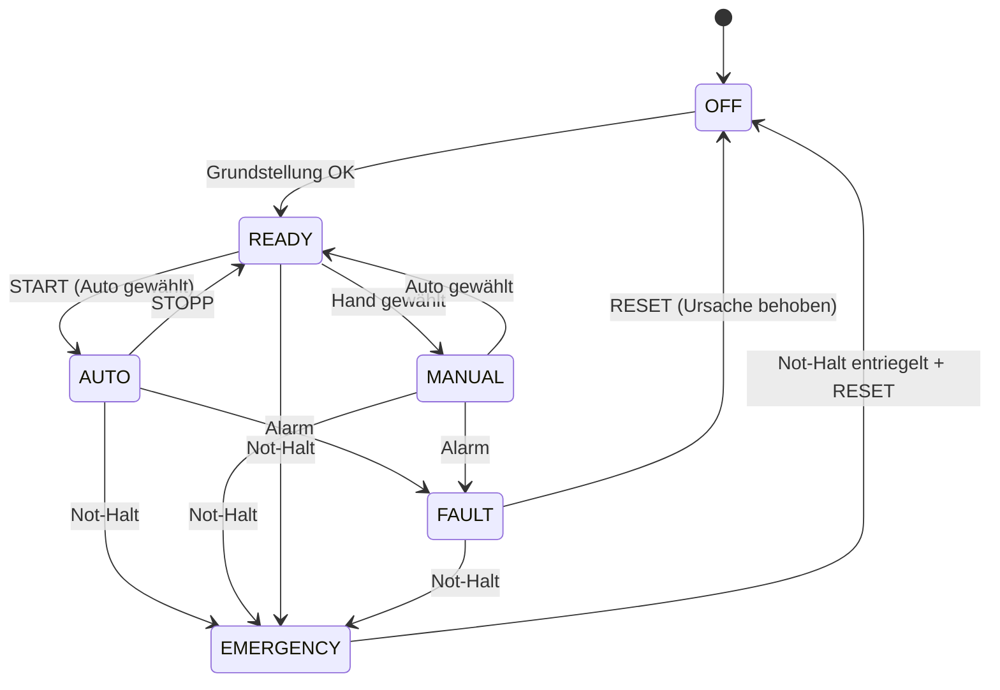
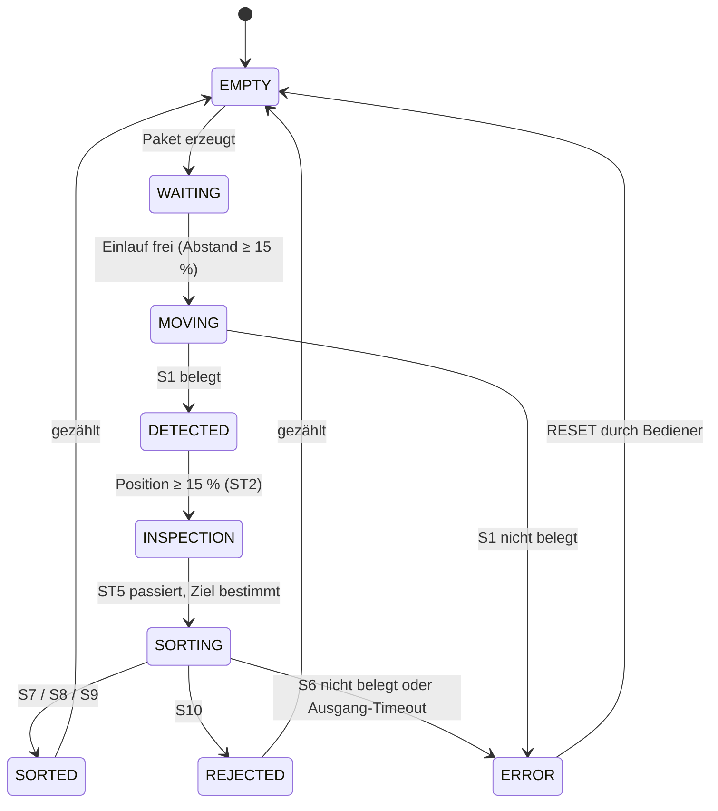

# Anlagenkonfiguration – Förderband-Sortieranlage

Konkrete Auslegung der Anlage auf Basis der [FeatureSpec](FeatureSpec.md). Dieses Dokument ist die Grundlage für UDTs, FBs und HMI.

## 1. Bandgeometrie

| Größe                     | Wert                         |
|---------------------------|------------------------------|
| Bandlänge                 | 10 m (= 100 %)               |
| Umrechnung                | 1 % = 0,1 m                  |
| Bandgeschwindigkeit       | 0,5 m/s (= 5 %/s), konstant  |
| Durchlaufzeit Einlauf → Bandende | 20 s                  |
| Paketlänge (angenommen)   | 0,4 m (= 4 %)                |
| Mindestabstand Pakete     | 1,5 m (= 15 % = 3 s)         |
| Erzeugungsrate (Standard) | alle 3 s, einstellbar 3–10 s |
| Max. aktive Pakete        | 5                            |

Die Paketposition bezieht sich auf die **Paketmitte**. Ein Sensor gilt als belegt, solange die Paketmitte im Bereich ±2 % um die Sensorposition liegt (halbe Paketlänge).

**Takt:** Das gesamte Anlagenprogramm läuft im Weckalarm-OB30 mit 100 ms (`CYCLE_TIME`). Pro Durchlauf wandert ein Paket um 0,5 % weiter. Damit ist die Bewegung unabhängig von der schwankenden OB1-Zykluszeit, OB1 bleibt leer.

## 2. Stationen und Positionen

```
Pos. %   0   2        15       25       35       45    55    65    75    85        100
         │   │        │        │        │        │     │     │     │     │          │
         ════╪════════╪════════╪════════╪════════╪═════╪═════╪═════╪═════╪══════════►
         ▲   S1       S2       S3       S4       S5    S6    Q1    Q2    Q3   Bandende
      Einlauf│        │        │        │        │     │     │     │     │          │
         ST1 Erkennung│        │        │        │     │     ▼     ▼     ▼          ▼
                  ST2 Größe    │        │        │     │  Ausg.1 Ausg.2 Ausg.3   Ausg.4
                           ST3 Material │        │     │  (S7)  (S8)  (S9)     (S10)
                                    ST4 Gewicht  │     │
                                             ST5 Qualität + Ziel
                                                   ST6 Sortierstrecke (55–100 %)
```

| Station | Position | Sensor/Aktor | Aufgabe |
|---------|----------|--------------|---------|
| ST1 – Einlauf/Erkennung | 2 %  | S1 | Paket erkannt, Status → DETECTED |
| ST2 – Größe             | 15 % | S2 | Größe klein/groß übernehmen |
| ST3 – Material          | 25 % | S3 | Metall/Kunststoff übernehmen |
| ST4 – Gewicht           | 35 % | S4 | Gewicht übernehmen |
| ST5 – Qualität + Ziel   | 45 % | S5 | Qualität übernehmen, Ziel nach Sortierregeln bestimmen |
| ST6 – Sortierstrecke    | 55 % | S6 | Kontrolle: Paket ist dort, wo die Verfolgung es erwartet |
|                         | 65 % | Q1 | Sortierer 1 → Ausgang 1 (Metall) |
|                         | 75 % | Q2 | Sortierer 2 → Ausgang 2 (Kunststoff klein) |
|                         | 85 % | Q3 | Sortierer 3 → Ausgang 3 (Kunststoff groß) |
|                         | 100 % | – | Bandende → Ausgang 4 (Ausschuss) |

### Ausschuss am Bandende (Fail-safe)

Ausgang 4 hat **keinen eigenen Aktor**. Jedes Paket, das nicht von Q1–Q3 ausgeschleust wird, läuft am Bandende in den Ausschuss. Damit landet ein Paket bei einer Störung (Sortierer reagiert nicht, Ziel unbekannt) nie im falschen Gutteil-Ausgang, sondern immer im Ausschuss. Die frühere Ausschussklappe Q4 entfällt deshalb.

### Zeitliche Prüfung

| Vorgang | Zeit |
|---|---|
| Abstand zweier Sortierer (10 %) | 2 s |
| Sortierer ausfahren | 0,5 s |
| Sortierer einfahren | 0,5 s |
| Sortierzyklus gesamt | ca. 1 s |
| Abstand zweier Pakete (min.) | 3 s |

Ein Sortierer ist also sicher wieder eingefahren, bevor das nächste Paket seine Position erreicht.

Bei 20 s Durchlaufzeit und 3 s Erzeugungsrate würden bis zu 6–7 Pakete gleichzeitig auf dem Band liegen. Die Grenze von 5 aktiven Paketen greift daher im Normalbetrieb und lässt sich testen.

## 3. Sensoren

| Kennung | Station | Typ (real) | Signal | Bedeutung |
|---------|---------|------------|--------|-----------|
| S1  | ST1 | Lichtschranke         | BOOL | Paket am Einlauf |
| S2  | ST2 | Lichtschranke (hoch)  | BOOL | TRUE = Paket groß |
| S3  | ST3 | induktiver Sensor     | BOOL | TRUE = Metall |
| S4  | ST4 | Wägezelle (analog)    | INT  | 0–27648 = 0–10 kg |
| S5  | ST5 | Kamera/Prüfsystem     | BOOL | TRUE = Qualität OK |
| S6  | ST6 | Lichtschranke         | BOOL | Paket am Beginn der Sortierstrecke |
| S7  | Ausgang 1 | Lichtschranke Rutsche | BOOL | Paket in Ausgang 1 angekommen |
| S8  | Ausgang 2 | Lichtschranke Rutsche | BOOL | Paket in Ausgang 2 angekommen |
| S9  | Ausgang 3 | Lichtschranke Rutsche | BOOL | Paket in Ausgang 3 angekommen |
| S10 | Ausgang 4 | Lichtschranke Bandende | BOOL | Paket in Ausschuss angekommen |
| S11 | Q1 | Endlagenschalter | BOOL | Sortierer 1 eingefahren |
| S12 | Q1 | Endlagenschalter | BOOL | Sortierer 1 ausgefahren |
| S13 | Q2 | Endlagenschalter | BOOL | Sortierer 2 eingefahren |
| S14 | Q2 | Endlagenschalter | BOOL | Sortierer 2 ausgefahren |
| S15 | Q3 | Endlagenschalter | BOOL | Sortierer 3 eingefahren |
| S16 | Q3 | Endlagenschalter | BOOL | Sortierer 3 ausgefahren |
| B1  | –  | Not-Halt-Taster (Öffner) | BOOL | TRUE = kein Not-Halt |
| B2  | M1 | Motorschutzschalter  | BOOL | TRUE = Motor OK |

Die Endlagenschalter S11–S16 sind neu. Ohne sie lässt sich der Alarm „Sortierer nicht zurückgefahren“ nicht erkennen.

## 4. Aktoren

| Kennung | Typ (real) | Signal | Bedeutung |
|---------|------------|--------|-----------|
| M1 | Drehstrommotor über Schütz | BOOL | Förderband läuft |
| Q1 | Magnetventil, monostabil (Federrückstellung) | BOOL | TRUE = Sortierer 1 ausfahren |
| Q2 | Magnetventil, monostabil | BOOL | TRUE = Sortierer 2 ausfahren |
| Q3 | Magnetventil, monostabil | BOOL | TRUE = Sortierer 3 ausfahren |
| H1 | Meldeleuchte grün | BOOL | Betrieb (Dauerlicht = Automatik läuft, Blinken = bereit) |
| H2 | Meldeleuchte rot | BOOL | Störung (Blinken = neu, Dauerlicht = quittiert) |

Monostabile Ventile fahren bei Spannungsausfall oder Not-Halt selbstständig zurück. Das ist der sichere Zustand.

## 5. I/O-Liste

Die Adressen sind so gewählt, dass sie auf eine S7-1200 (z. B. CPU 1214C mit Onboard-I/O) wie auch auf eine S7-1500 passen.

### Eingänge

| Adresse | Symbol           | Kennung | Datentyp | Beschreibung |
|---------|------------------|---------|----------|--------------|
| %I0.0 | `iEmergencyStopOk` | B1  | Bool | Not-Halt nicht betätigt (Öffner) |
| %I0.1 | `iMotorProtectOk`  | B2  | Bool | Motorschutz M1 OK |
| %I0.2 | `iInfeed`          | S1  | Bool | Paket am Einlauf |
| %I0.3 | `iSizeLarge`       | S2  | Bool | Paket groß |
| %I0.4 | `iMetal`           | S3  | Bool | Metall erkannt |
| %I0.5 | `iQualityOk`       | S5  | Bool | Qualität OK |
| %I0.6 | `iSortEntry`       | S6  | Bool | Paket am Beginn Sortierstrecke |
| %I0.7 | `iExit1`           | S7  | Bool | Paket in Ausgang 1 |
| %I1.0 | `iExit2`           | S8  | Bool | Paket in Ausgang 2 |
| %I1.1 | `iExit3`           | S9  | Bool | Paket in Ausgang 3 |
| %I1.2 | `iExitReject`      | S10 | Bool | Paket in Ausschuss |
| %I1.3 | `iSorter1Retracted`| S11 | Bool | Sortierer 1 eingefahren |
| %I1.4 | `iSorter1Extended` | S12 | Bool | Sortierer 1 ausgefahren |
| %I1.5 | `iSorter2Retracted`| S13 | Bool | Sortierer 2 eingefahren |
| %I1.6 | `iSorter2Extended` | S14 | Bool | Sortierer 2 ausgefahren |
| %I1.7 | `iSorter3Retracted`| S15 | Bool | Sortierer 3 eingefahren |
| %I2.0 | `iSorter3Extended` | S16 | Bool | Sortierer 3 ausgefahren |
| %IW64 | `iWeightRaw`       | S4  | Int  | Waage, 0–27648 = 0–10 kg |

### Ausgänge

| Adresse | Symbol         | Kennung | Datentyp | Beschreibung |
|---------|----------------|---------|----------|--------------|
| %Q0.0 | `qConveyor`      | M1 | Bool | Förderband EIN |
| %Q0.1 | `qSorter1`       | Q1 | Bool | Sortierer 1 ausfahren |
| %Q0.2 | `qSorter2`       | Q2 | Bool | Sortierer 2 ausfahren |
| %Q0.3 | `qSorter3`       | Q3 | Bool | Sortierer 3 ausfahren |
| %Q0.4 | `qLampRun`       | H1 | Bool | Betriebsleuchte |
| %Q0.5 | `qLampFault`     | H2 | Bool | Störungsleuchte |

Bedienelemente (Start, Stopp, Reset, Hand/Auto, Handfunktionen) liegen ausschließlich im HMI und haben keine Hardware-Adresse.

### Simulation und I/O

Da es keine echte Hardware gibt, schreibt die Simulation die Sensorsignale. Damit das sauber bleibt, liest die Steuerung **nie direkt** von `%I`, sondern über eine Abbildungsschicht:

```
                 ┌──────────────────┐
  %I (Hardware) ─┤                  │
                 │ FB_InputMapping  ├──► DB_IO.Inputs ──► Steuerlogik
  FB_Simulation ─┤ (SimMode wählt)  │
                 └──────────────────┘

  Steuerlogik ──► DB_IO.Outputs ──► FB_OutputMapping ──► %Q
                                └──► FB_Simulation (Sortierer, Band)
```

- **SimMode = TRUE:** Die Eingänge kommen aus `FB_Simulation`. Die Simulation liest die Ausgänge (Band, Sortierer) und erzeugt daraus die passenden Sensorsignale, z. B. die Endlagen 0,5 s nach dem Ansteuern eines Sortierers.
- **SimMode = FALSE:** Die Eingänge kommen von `%I`. Die Steuerlogik bleibt unverändert und könnte so an echte Hardware angeschlossen werden.

## 6. Anlagenzustand

Der Anlagenzustand wird getrennt vom Paketstatus geführt.

| Zustand     | Bedeutung | H1 | H2 |
|-------------|-----------|----|----|
| OFF         | Band aus, keine Betriebsart aktiv | aus | aus |
| READY       | Grundstellung erreicht (alle Sortierer eingefahren, kein Alarm) | blinkt | aus |
| AUTO        | Automatikbetrieb läuft | an | aus |
| MANUAL      | Handbetrieb | blinkt | aus |
| FAULT       | Störung aktiv, Band steht | aus | blinkt / an |
| EMERGENCY   | Not-Halt betätigt | aus | blinkt |



## 7. Paketstatus

Gegenüber der FeatureSpec kommen zwei Zustände hinzu: **EMPTY** für einen freien Platz im Array und **ERROR** für ein Paket, dessen Verfolgung verloren ging.

| Status     | Bedeutung |
|------------|-----------|
| EMPTY      | Platz im Array frei |
| WAITING    | Paket erzeugt, wartet auf freien Einlauf (Mindestabstand) |
| MOVING     | auf dem Band, vor ST1 |
| DETECTED   | an ST1 erkannt |
| INSPECTION | durchläuft ST2–ST5 |
| SORTING    | Ziel bestimmt, auf der Sortierstrecke |
| SORTED     | in Ausgang 1–3 angekommen |
| REJECTED   | in Ausgang 4 angekommen |
| ERROR      | Paket nicht dort erkannt, wo es erwartet wurde |



Ein Paket, das ein Ziel 1–3 hat, aber am Bandende ankommt (z. B. weil der Sortierer nicht ausgefahren ist), wird als **REJECTED** gezählt und löst zusätzlich einen Alarm aus.

## 8. Alarme

| Nr. | Alarm | Auslöser | Reaktion |
|-----|-------|----------|----------|
| 1 | Not-Halt | B1 = FALSE | Band sofort aus, Sortierer stromlos, Zustand EMERGENCY |
| 2 | Motorschutz ausgelöst | B2 = FALSE | Band aus, FAULT |
| 3 | Sortierer 1–3 nicht ausgefahren | Endlage „ausgefahren“ nicht nach 1 s | Band aus, FAULT |
| 4 | Sortierer 1–3 nicht zurückgefahren | Endlage „eingefahren“ nicht nach 1 s | Band aus, FAULT |
| 5 | Endlagen unplausibel | eingefahren und ausgefahren gleichzeitig | Band aus, FAULT |
| 6 | Paket nicht erkannt | S1 oder S6 nicht belegt, obwohl ein Paket dort sein müsste | Paket → ERROR, Band aus, FAULT |
| 7 | Paket nicht am Ausgang | S7–S10 nicht innerhalb 2 s nach Ausschleusen bzw. Bandende | Paket → ERROR, Band aus, FAULT |
| 8 | Fehlsortierung | Paket mit Ziel 1–3 erreicht das Bandende | Paket → REJECTED, Warnung (Band läuft weiter) |
| 9 | Waage Messfehler | S4 außerhalb 0–27648 | Paket → Ausschuss, Warnung |

### Bitbelegung

Die Alarme liegen als Bits in den Words von [`UDT_Alarm`](../src/UDT/UDT_Alarm.udt). Die Sortierer-Alarme 3 und 4 bekommen je Sortierer ein eigenes Bit, damit im HMI sichtbar ist, welcher Sortierer betroffen ist.

| Bit | Konstante | Alarm | Art |
|-----|-----------|-------|-----|
| 0  | `ALM_EMERGENCY_STOP`      | Not-Halt | Störung |
| 1  | `ALM_MOTOR_PROTECT`       | Motorschutz ausgelöst | Störung |
| 2–4 | `ALM_SORTER1..3_EXTEND`  | Sortierer 1–3 nicht ausgefahren | Störung |
| 5–7 | `ALM_SORTER1..3_RETRACT` | Sortierer 1–3 nicht zurückgefahren | Störung |
| 8  | `ALM_SORTER_PLAUSIBILITY` | Endlagen unplausibel | Störung |
| 9  | `ALM_PACKAGE_LOST`        | Paket nicht erkannt | Störung |
| 10 | `ALM_EXIT_TIMEOUT`        | Paket nicht am Ausgang | Störung |
| 11 | `ALM_MISSORT`             | Fehlsortierung | Warnung |
| 12 | `ALM_SCALE_FAULT`         | Waage Messfehler | Warnung |
| 13–15 | – | Reserve | – |

## 9. Simulierte Störungen

Für die Fehlertests lassen sich im HMI (Diagnosebild) gezielt Störungen auslösen:

| Störung | Wirkung in der Simulation | Erwarteter Alarm |
|---------|---------------------------|------------------|
| Sortierer 1/2/3 blockiert | Endlage „ausgefahren“ wird nie erreicht | Nr. 3 |
| Sortierer 1/2/3 klemmt | Endlage „eingefahren“ wird nicht wieder erreicht | Nr. 4 |
| Lichtschranke S6 defekt | S6 bleibt FALSE | Nr. 6 |
| Motorschutz auslösen | B2 = FALSE | Nr. 2 |
| Not-Halt betätigen | B1 = FALSE | Nr. 1 |
| Waage defekt | S4 = 32767 (Überlauf) | Nr. 9 |
